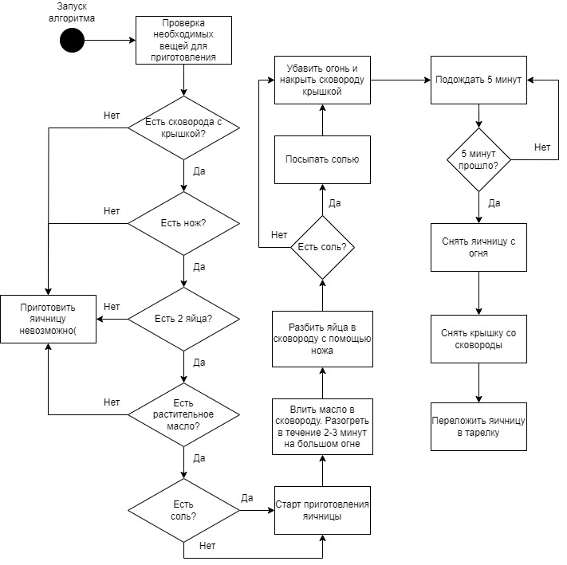

# Как приготовить яичницу

Если вам нужно быстро и вкусно поесть, яичница — идеальное решение!

Для приготовления потребуются:

* Сковорода с крышкой.
* Нож.
* Яйца — 2 штуки.
* Растительное масло — одна столовая ложка.
* (Опционально) Щепотка соли.

Чтобы приготовить яичницу:

1. В сковороду влейте масло и разогревайте его несколько минут на большом огне.
1. Разбейте яйца в сковороду с помощью ножа.

    > Старайтесь наносить несильные удары примерно по центру яйца. Это позволит избежать попадания скорлупы в блюдо.

1. (Опционально) Посыпьте яйца солью.
1. Убавьте огонь и накройте сковороду крышкой.

В таком виде яичница готовится около 5 минут. Когда время выйдет:

1. Снимите сковороду с огня.
1. Снимите крышку со сковороды.
1. Переложите яичницу на тарелку.

Блюдо готово. Ура!

## Схема приготовления яичницы

