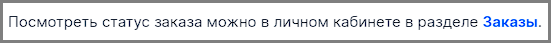

# Обратная связь

Рассматриваемая статья — [Как посмотреть статус заказа](https://docs.ozon.ru/common/moj-zakaz/gde-moj-zakaz/?country=RU).

1. Название статьи не очень отражает ее содержание. Я бы перенес заголовок на второй уровень, а саму статью назвал бы **Вопросы по статусу заказа**. Понимаю, что заголовок выбран для консистентности с заголовками других статей, но это немного сбивает с толку.
1. После вводных предложений привычнее видеть `:` а не `.`. Например, вот здесь:

    

    

1. В разделе **Что означает статус заказа** есть пример, оформленный в виде примечания. Я бы заменил в примере `Одна` на `Первая`. В текущем виде есть ощущение, что упаковки называются не в порядке отправки, а перечисляются однородно. 
1. В раздел **Когда приедет заказ** я бы добавил таб с мобильным приложением.
1. Не очень понял, почему для инфо в разделе **Почему мой заказ отменили** создана отдельная статья. Кажется, можно использовать контент оттуда в рамках основной статьи.